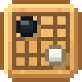
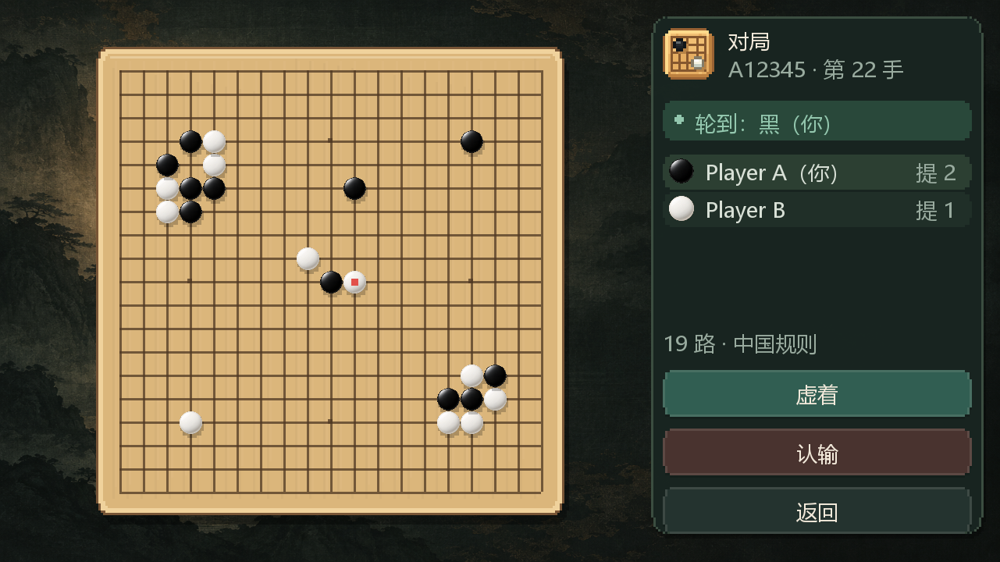

# GoGame · MCphone 围棋



在 Minecraft 的手机里约一局围棋。

GoGame 是 [MCphone](https://github.com/november521/mcphone) 的围棋附属模组，面向 **Minecraft 1.21.1 / NeoForge**。手机内提供创建房间、加入对局和 AI 设置，全屏棋盘负责实际落子；支持好友双人对弈与通过大模型 API 进行的人机对弈。

## 功能

- **好友对弈**：通过六位房间号加入，或邀请在线玩家；服务端负责合法着判断、提子与终局结果。
- **人机对弈**：支持 OpenAI 兼容接口，包含 GPT、通义千问、DeepSeek、智谱清言和自定义服务地址入口。
- **19 路棋盘**：全屏对局界面，显示当前回合、双方信息、提子数、最后一手及落点预览。
- **中国规则**：数子法、黑贴 3¾ 子、禁自杀、打劫禁着；支持虚着、认输与零合法着时自动虚着。
- **连接处理**：PVP 对手掉线时暂停对局，提供 60 秒重连宽限；超时按现有规则判负。
- **统一界面**：木质棋盘、墨色背景、黑白棋子，以及与 MCphone 原生应用一致的 20×20 像素图标；大厅跟随手机主题，提供中英双语。



*上图是组件样式预览，使用示例局面；实际字体、缩放和交互以游戏内显示为准。*

## 版本与安装

| 项目 | 要求 |
| --- | --- |
| Minecraft | 1.21.1 |
| 加载器 | NeoForge 21.1.200 及以上；开发验证版本为 21.1.250 |
| MCphone | 客户端需要；编译与开发验证依赖为 1.9.3，元数据声明最低 1.9.3 |
| Java | 游戏运行与编译目标为 Java 21 |

1. 准备 Minecraft 1.21.1 的 NeoForge 游戏实例。
2. 按 MCphone 本体说明安装手机模组。
3. 将构建得到的 `gogame-1.0.0.jar` 放入该实例的 `mods/` 目录。
4. 进入世界，打开手机中的「围棋」应用。

双人对弈需要双方客户端及服务端安装 GoGame。GoGame 的服务端仲裁与客户端界面分别加载；MCphone 本体的服务端安装要求请以其说明为准。

当前仓库实现的是 **NeoForge 1.21.1** 版本。

## 开始一局

### 与好友对弈

1. 在手机围棋大厅选择「创建对局」，选择执黑、执白或随机。
2. 将房间号告诉好友，让对方选择「凭号加入」；也可以在等待页邀请在线玩家。
3. 对局开始后进入全屏棋盘。轮到自己时点击交叉点落子，右侧可选择「虚着」或「认输」。

双方连续虚着后按盘面数子。当前实现没有独立的终局死子标记流程，终局前需要把死子提净；留在盘面上的棋子会参与计分。

### 与 AI 对弈

1. 在大厅选择「人机对弈」，进入「AI 设置」。
2. 选择服务方，填写 API Key 与服务地址，通过模型列表选择模型。
3. 返回选择难度及执色，开始对局。

难度提供菜鸟、普通人和初段至九段共 11 档，通过提示词、温度与失误策略调整表现；档位名称不代表模型具备对应的真实围棋段位。AI 使用 ASCII 棋盘和 SGF 文本获取局面，其着法必须通过本地规则校验；非法着会重试，仍未获得合法着时使用随机合法着兜底。

配置保存在游戏实例的 `config/gogame/config.json`，每个服务方分别保存 Key、地址和模型。文件以明文保存，界面仅显示 Key 末四位；不要把自己的配置文件提交到仓库或分享给他人。API 请求会发送到你填写的服务地址，调用费用以对应服务方为准。

## 构建与调试

建议使用 **JDK 21**，并通过项目自带的 Gradle Wrapper 构建。构建工程位于 `gogame-1.21.1/`，以下命令从仓库根目录开始。

**Windows / PowerShell：**

```powershell
cd gogame-1.21.1
.\gradlew.bat build
```

**Linux / macOS：**

```sh
cd gogame-1.21.1
chmod +x gradlew
./gradlew build
```

产物位于 `gogame-1.21.1/build/libs/gogame-1.0.0.jar`。MCphone 编译依赖位于 `libs/mcphone-1.9.3.jar`，版本由 `gradle.properties` 选择；它不会被打包进 GoGame 产物。首次构建需要下载 Gradle 和开发依赖，依赖缓存齐全后可添加 `--offline`。

在 `gogame-1.21.1/` 内可使用以下调试任务；Windows 将 `./gradlew` 换为 `.\gradlew.bat`：

| 命令 | 用途 |
| --- | --- |
| `./gradlew test` | 运行规则、对局与 AI 文本解析的单元测试 |
| `./gradlew runClient` | 启动玩家 A，使用 `run/` 目录 |
| `./gradlew runClient2` | 启动玩家 B，使用独立的 `run-client2/` 目录 |
| `./gradlew runServer` | 启动独立开发服务端，使用 `run-server/` 目录 |

双客户端使用不同玩家名，避免离线联机时 UUID 相同。开发服务端的 EULA、联机模式等配置需在本机准备，游戏存档与配置不会随源码上传。修改纹理后可在游戏中按 **F3+T** 重新加载资源；修改 Java 代码通常需要重新启动客户端。

## 项目结构与文档

```text
gogame-1.21.1/
  src/main/java/com/november/gogame/
    client/          手机界面、棋盘、图标与 AI 客户端
    common/          围棋规则、对局管理与网络协议
  src/main/resources/  图标、棋子、背景、语言与 SPI 登记
  src/main/templates/  NeoForge 元数据模板
  src/test/          单元测试
  libs/              MCphone 编译依赖
  tools/             可复现的像素图标绘制源
docs/                项目记录、技术说明与样式预览
```

- [项目记录](docs/PROJECT_LOG.md)：开发阶段、改动与验收记录。
- [技术栈](docs/TECH_STACK.md)：架构与依赖说明。
- [问题与修复记录](docs/PITFALLS.md)：已遇到问题及解决方法。
- [界面素材说明](docs/UI_ASSETS.md)：资源位置、图标绘制源和生成提示词。
- [MCphone UI 接口参考](mcphone-api-ui-reference.md)：用于开发时核对接口。
- [版本开发技能](docs/development-skills/)：NeoForge 1.21.1 与 Forge 1.20.1 的开发参考；其中 Forge 技能不代表已有 Forge 移植版本。

## 验证与许可

2026-10-06 的本地检查：项目构建成功，8 组 **101 项测试**通过。最近的界面改动包含组件预览与客户端加载检查；本次上传准备未重新执行双客户端完整对局或调用在线 AI 服务。

本仓库源码许可见 [LICENSE](LICENSE)。Minecraft、NeoForge、MCphone 及其他依赖的许可由各自项目提供。
